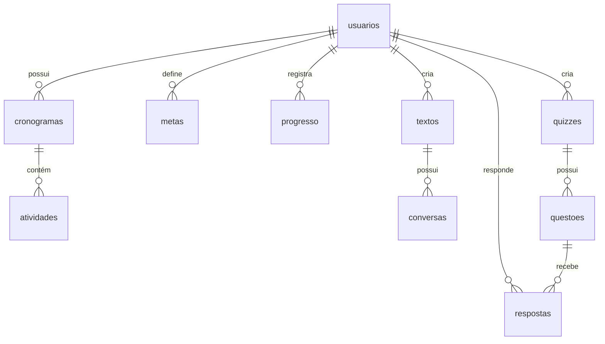
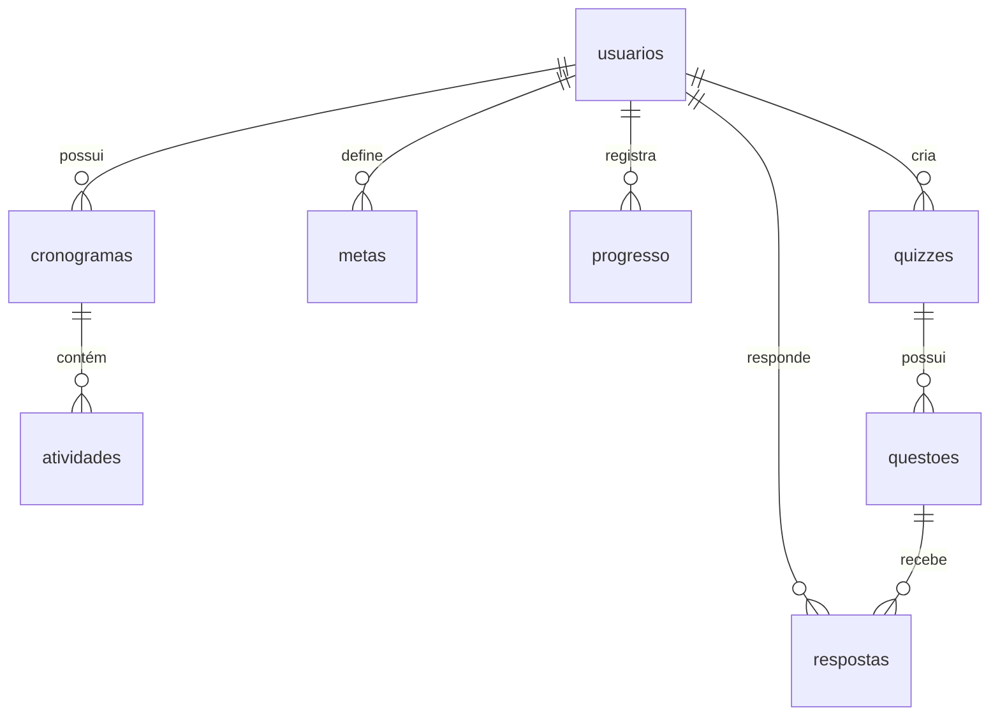

# 📊 Schema do Banco de Dados - Sistema Foco

Este documento descreve a estrutura completa do banco de dados do sistema Foco, um aplicativo de gerenciamento de estudos e produtividade.

## 🗂️ Visão Geral das Tabelas

O sistema possui **9 tabelas principais** organizadas em uma estrutura hierárquica:

```
usuarios (raiz)
├── cronogramas
│   └── atividades
├── metas
├── progresso
├── textos
│   └── conversas
└── quizzes
    ├── questoes
    └── respostas
```

## 📋 Detalhamento das Tabelas

### 👤 usuarios
**Descrição:** Tabela principal que armazena informações dos usuários do sistema.

| Campo | Tipo | Constraints | Descrição |
|-------|------|-------------|-----------|
| `id` | `uuid` | PK, NOT NULL, DEFAULT gen_random_uuid() | Identificador único do usuário |
| `nome` | `text` | NOT NULL | Nome completo do usuário |
| `email` | `text` | NOT NULL, UNIQUE | Email único para login |
| `criado_em` | `timestamp` | DEFAULT now() | Data/hora de criação do registro |

**Relacionamentos:**
- 1:N com `cronogramas`
- 1:N com `metas`
- 1:N com `progresso`
- 1:N com `textos`
- 1:N com `quizzes`
- 1:N com `respostas`

---

### 📅 cronogramas
**Descrição:** Cronogramas de estudo criados pelos usuários (containers para atividades).

| Campo | Tipo | Constraints | Descrição |
|-------|------|-------------|-----------|
| `id` | `uuid` | PK, NOT NULL, DEFAULT gen_random_uuid() | Identificador único do cronograma |
| `usuario_id` | `uuid` | FK → usuarios(id) | Proprietário do cronograma |
| `titulo` | `text` | NOT NULL | Título do cronograma |
| `descricao` | `text` | NULL | Descrição opcional |
| `data_inicio` | `date` | NOT NULL | Data de início do cronograma |
| `criado_em` | `timestamp` | DEFAULT now() | Data/hora de criação |

**Relacionamentos:**
- N:1 com `usuarios`
- 1:N com `atividades`

**Nota:** `data_fim` é calculada dinamicamente baseada na atividade mais tardia.

---

### ✅ atividades
**Descrição:** Atividades específicas dentro de um cronograma com datas e status.

| Campo | Tipo | Constraints | Descrição |
|-------|------|-------------|-----------|
| `id` | `uuid` | PK, NOT NULL, DEFAULT gen_random_uuid() | Identificador único da atividade |
| `cronograma_id` | `uuid` | FK → cronogramas(id) | Cronograma pai |
| `titulo` | `text` | NOT NULL | Título da atividade |
| `descricao` | `text` | NULL | Descrição opcional |
| `data_inicio` | `date` | NOT NULL | Data de início da atividade |
| `data_fim` | `date` | NULL | Data de fim da atividade |
| `status` | `text` | DEFAULT 'pendente', CHECK ('pendente', 'em_andamento', 'concluida') | Status atual |

**Relacionamentos:**
- N:1 com `cronogramas`

---

### 🎯 metas
**Descrição:** Metas de estudo dos usuários.

| Campo | Tipo | Constraints | Descrição |
|-------|------|-------------|-----------|
| `id` | `uuid` | PK, NOT NULL, DEFAULT gen_random_uuid() | Identificador único da meta |
| `usuario_id` | `uuid` | FK → usuarios(id) | Proprietário da meta |
| `titulo` | `text` | NOT NULL | Título da meta |
| `descricao` | `text` | NULL | Descrição opcional |
| `valor_esperado` | `integer` | NULL | Valor numérico esperado |
| `data_limite` | `date` | NULL | Data limite para atingir |
| `atingida` | `boolean` | DEFAULT false | Se a meta foi atingida |

**Relacionamentos:**
- N:1 com `usuarios`

---

### 📈 progresso
**Descrição:** Registros diários de progresso de estudo.

| Campo | Tipo | Constraints | Descrição |
|-------|------|-------------|-----------|
| `id` | `uuid` | PK, NOT NULL, DEFAULT gen_random_uuid() | Identificador único do registro |
| `usuario_id` | `uuid` | FK → usuarios(id) | Usuário do progresso |
| `data` | `date` | NOT NULL | Data do registro |
| `horas_estudadas` | `integer` | NOT NULL, CHECK >= 0 | Horas estudadas no dia |

**Relacionamentos:**
- N:1 com `usuarios`

---

### 📝 textos
**Descrição:** Textos e resumos gerados pela IA para os usuários.

| Campo | Tipo | Constraints | Descrição |
|-------|------|-------------|-----------|
| `id` | `uuid` | PK, NOT NULL, DEFAULT gen_random_uuid() | Identificador único do texto |
| `usuario_id` | `uuid` | FK → usuarios(id) | Proprietário do texto |
| `titulo` | `text` | NOT NULL | Título do texto |
| `conteudo` | `text` | NOT NULL | Conteúdo completo do texto |
| `tipo` | `text` | DEFAULT 'texto', CHECK ('texto', 'resumo') | Tipo do conteúdo |
| `prompt_original` | `text` | NOT NULL | Prompt usado para gerar o texto |
| `salvo` | `boolean` | DEFAULT false | Se o usuário salvou como importante |
| `criado_em` | `timestamp` | DEFAULT now() | Data/hora de criação |

**Relacionamentos:**
- N:1 com `usuarios`
- 1:N com `conversas`

---

### 💬 conversas
**Descrição:** Conversas/continuações sobre textos específicos.

| Campo | Tipo | Constraints | Descrição |
|-------|------|-------------|-----------|
| `id` | `uuid` | PK, NOT NULL, DEFAULT gen_random_uuid() | Identificador único da conversa |
| `texto_id` | `uuid` | FK → textos(id) | Texto relacionado |
| `prompt` | `text` | NOT NULL | Prompt/pergunta do usuário |
| `resposta` | `text` | NOT NULL | Resposta gerada pela IA |
| `criado_em` | `timestamp` | DEFAULT now() | Data/hora da conversa |

**Relacionamentos:**
- N:1 com `textos`

---

### 🧠 quizzes
**Descrição:** Quizzes criados pelos usuários.

| Campo | Tipo | Constraints | Descrição |
|-------|------|-------------|-----------|
| `id` | `uuid` | PK, NOT NULL, DEFAULT gen_random_uuid() | Identificador único do quiz |
| `usuario_id` | `uuid` | FK → usuarios(id) | Criador do quiz |
| `titulo` | `text` | NOT NULL | Título do quiz |
| `criado_em` | `timestamp` | DEFAULT now() | Data/hora de criação |

**Relacionamentos:**
- N:1 com `usuarios`
- 1:N com `questoes`

---

### ❓ questoes
**Descrição:** Questões individuais de um quiz.

| Campo | Tipo | Constraints | Descrição |
|-------|------|-------------|-----------|
| `id` | `uuid` | PK, NOT NULL, DEFAULT gen_random_uuid() | Identificador único da questão |
| `quiz_id` | `uuid` | FK → quizzes(id) | Quiz pai |
| `enunciado` | `text` | NOT NULL | Texto da questão |
| `alternativa_a` | `text` | NOT NULL | Opção A |
| `alternativa_b` | `text` | NOT NULL | Opção B |
| `alternativa_c` | `text` | NOT NULL | Opção C |
| `alternativa_d` | `text` | NOT NULL | Opção D |
| `correta` | `char` | CHECK ('A', 'B', 'C', 'D') | Alternativa correta |

**Relacionamentos:**
- N:1 com `quizzes`
- 1:N com `respostas`

---

### 📝 respostas
**Descrição:** Respostas dos usuários às questões dos quizzes.

| Campo | Tipo | Constraints | Descrição |
|-------|------|-------------|-----------|
| `id` | `uuid` | PK, NOT NULL, DEFAULT gen_random_uuid() | Identificador único da resposta |
| `questao_id` | `uuid` | FK → questoes(id) | Questão respondida |
| `usuario_id` | `uuid` | FK → usuarios(id) | Usuário que respondeu |
| `resposta_dada` | `char` | CHECK ('A', 'B', 'C', 'D') | Alternativa escolhida |
| `correta` | `boolean` | NULL | Se a resposta estava correta |
| `respondido_em` | `timestamp` | DEFAULT now() | Data/hora da resposta |

**Relacionamentos:**
- N:1 com `questoes`
- N:1 com `usuarios`

---

## 🔗 Diagrama de Relacionamentos



## 💡 Casos de Uso Principais

### 📅 Cronogramas & ✅ Atividades
- Usuário cria cronograma (ex: "Estudos de React")
- Adiciona atividades específicas com datas (ex: "Hooks - 01/08 a 05/08")
- Acompanha progresso por atividade

### 🎯 Metas & 📈 Progresso
- Define metas numéricas (ex: "50 horas de estudo este mês")
- Registra progresso diário
- Sistema calcula se meta foi atingida

### 🧠 Quizzes & 📝 Avaliações
- Cria quizzes personalizados
- Adiciona questões múltipla escolha
- Registra tentativas e performance

### 📝 Textos & 💬 Conversas
- Gera textos e resumos via IA
- Continua conversas sobre textos específicos
- Salva textos importantes para consulta posterior
- Mantém histórico de conversas por texto

---

## 🚀 Considerações Técnicas

### Constraints Importantes
- `email` é UNIQUE para evitar duplicatas
- `status` das atividades tem valores controlados
- `horas_estudadas` não pode ser negativo
- Alternativas dos quizzes são limitadas a A, B, C, D
- `salvo` nos textos indica importância para o usuário

### Índices Recomendados
- `usuarios(email)` - para login
- `cronogramas(usuario_id)` - queries por usuário
- `atividades(cronograma_id)` - atividades de um cronograma
- `textos(usuario_id)` - textos por usuário
- `textos(usuario_id, salvo)` - textos salvos por usuário
- `conversas(texto_id)` - conversas de um texto
- `progresso(usuario_id, data)` - relatórios de progresso
- `atividades(cronograma_id)` - atividades de um cronograma
- `progresso(usuario_id, data)` - relatórios de progresso

### Política de Dados
- Soft delete recomendado para cronogramas e quizzes
- Logs de auditoria para alterações críticas
- Backup regular devido à natureza educacional dos dados

**Relacionamentos:**
- 1:N com `cronogramas`
- 1:N com `metas` 
- 1:N com `progresso`
- 1:N com `quizzes`
- 1:N com `respostas`

---

### 📅 cronogramas
**Descrição:** Cronogramas de estudo criados pelos usuários.

| Campo | Tipo | Constraints | Descrição |
|-------|------|-------------|-----------|
| `id` | `uuid` | PK, NOT NULL, DEFAULT gen_random_uuid() | Identificador único do cronograma |
| `usuario_id` | `uuid` | FK → usuarios(id) | Proprietário do cronograma |
| `titulo` | `text` | NOT NULL | Título do cronograma |
| `descricao` | `text` | NULL | Descrição opcional |
| `criado_em` | `timestamp` | DEFAULT now() | Data/hora de criação |

**Relacionamentos:**
- N:1 com `usuarios`
- 1:N com `atividades`

---

### ✅ atividades
**Descrição:** Atividades específicas dentro de um cronograma.

| Campo | Tipo | Constraints | Descrição |
|-------|------|-------------|-----------|
| `id` | `uuid` | PK, NOT NULL, DEFAULT gen_random_uuid() | Identificador único da atividade |
| `cronograma_id` | `uuid` | FK → cronogramas(id) | Cronograma pai |
| `titulo` | `text` | NOT NULL | Título da atividade |
| `descricao` | `text` | NULL | Descrição opcional |
| `data_inicio` | `date` | NOT NULL | Data de início |
| `data_fim` | `date` | NULL | Data de fim (opcional) |
| `status` | `text` | DEFAULT 'pendente', CHECK | Status da atividade |

**Valores válidos para `status`:**
- `'pendente'` (padrão)
- `'em_andamento'`
- `'concluida'`

**Relacionamentos:**
- N:1 com `cronogramas`

---

### 🎯 metas
**Descrição:** Metas de estudo definidas pelos usuários.

| Campo | Tipo | Constraints | Descrição |
|-------|------|-------------|-----------|
| `id` | `uuid` | PK, NOT NULL, DEFAULT gen_random_uuid() | Identificador único da meta |
| `usuario_id` | `uuid` | FK → usuarios(id) | Proprietário da meta |
| `titulo` | `text` | NOT NULL | Título da meta |
| `descricao` | `text` | NULL | Descrição opcional |
| `valor_esperado` | `integer` | NULL | Valor numérico da meta |
| `data_limite` | `date` | NULL | Data limite para atingir |
| `atingida` | `boolean` | DEFAULT false | Se a meta foi atingida |

**Relacionamentos:**
- N:1 com `usuarios`

---

### 📈 progresso
**Descrição:** Registro diário de horas estudadas pelos usuários.

| Campo | Tipo | Constraints | Descrição |
|-------|------|-------------|-----------|
| `id` | `uuid` | PK, NOT NULL, DEFAULT gen_random_uuid() | Identificador único do registro |
| `usuario_id` | `uuid` | FK → usuarios(id) | Usuário que estudou |
| `data` | `date` | NOT NULL | Data do estudo |
| `horas_estudadas` | `integer` | NOT NULL, CHECK >= 0 | Horas estudadas no dia |

**Relacionamentos:**
- N:1 com `usuarios`

---

### 📝 quizzes
**Descrição:** Quizzes criados pelos usuários para autoavaliação.

| Campo | Tipo | Constraints | Descrição |
|-------|------|-------------|-----------|
| `id` | `uuid` | PK, NOT NULL, DEFAULT gen_random_uuid() | Identificador único do quiz |
| `usuario_id` | `uuid` | FK → usuarios(id) | Criador do quiz |
| `titulo` | `text` | NOT NULL | Título do quiz |
| `criado_em` | `timestamp` | DEFAULT now() | Data/hora de criação |

**Relacionamentos:**
- N:1 com `usuarios`
- 1:N com `questoes`

---

### ❓ questoes
**Descrição:** Questões de múltipla escolha dentro dos quizzes.

| Campo | Tipo | Constraints | Descrição |
|-------|------|-------------|-----------|
| `id` | `uuid` | PK, NOT NULL, DEFAULT gen_random_uuid() | Identificador único da questão |
| `quiz_id` | `uuid` | FK → quizzes(id) | Quiz pai |
| `enunciado` | `text` | NOT NULL | Texto da pergunta |
| `alternativa_a` | `text` | NOT NULL | Opção A |
| `alternativa_b` | `text` | NOT NULL | Opção B |
| `alternativa_c` | `text` | NOT NULL | Opção C |
| `alternativa_d` | `text` | NOT NULL | Opção D |
| `correta` | `character` | CHECK | Alternativa correta |

**Valores válidos para `correta`:**
- `'A'`, `'B'`, `'C'`, `'D'`

**Relacionamentos:**
- N:1 com `quizzes`
- 1:N com `respostas`

---

### 💬 respostas
**Descrição:** Respostas dos usuários às questões dos quizzes.

| Campo | Tipo | Constraints | Descrição |
|-------|------|-------------|-----------|
| `id` | `uuid` | PK, NOT NULL, DEFAULT gen_random_uuid() | Identificador único da resposta |
| `questao_id` | `uuid` | FK → questoes(id) | Questão respondida |
| `usuario_id` | `uuid` | FK → usuarios(id) | Usuário que respondeu |
| `resposta_usuario` | `character` | CHECK | Alternativa escolhida pelo usuário |
| `correta` | `boolean` | NULL | Se a resposta está correta |
| `respondido_em` | `timestamp` | DEFAULT now() | Data/hora da resposta |

**Valores válidos para `resposta_usuario`:**
- `'A'`, `'B'`, `'C'`, `'D'`

**Relacionamentos:**
- N:1 com `questoes`
- N:1 com `usuarios`

## 🔗 Diagrama de Relacionamentos



## 📊 Casos de Uso por Tabela

### 👤 Usuários
- Registro e autenticação
- Perfil de usuário
- Histórico de atividades

### 📅 Cronogramas & ✅ Atividades
- Planejamento de estudos
- Organização temporal
- Acompanhamento de tarefas

### 🎯 Metas
- Definição de objetivos
- Acompanhamento de progresso
- Gamificação

### 📈 Progresso
- Registro diário de estudos
- Análise de performance
- Relatórios e gráficos

### 📝 Quizzes, ❓ Questões & 💬 Respostas
- Autoavaliação
- Teste de conhecimento
- Histórico de respostas
- Análise de acertos/erros

## 🛠️ Implementação

As interfaces TypeScript correspondentes estão em:
- `src/model/Usuario.ts`
- `src/model/Cronograma.ts`
- `src/model/Atividade.ts`
- `src/model/Meta.ts`
- `src/model/Progresso.ts`
- `src/model/Quiz.ts`
- `src/model/Questao.ts`
- `src/model/Resposta.ts`

Os testes CRUD completos estão em:
- `tests/integration/crud/[tabela].test.ts`

---

**Última atualização:** Agosto 2025
**Versão do Schema:** 1.0
